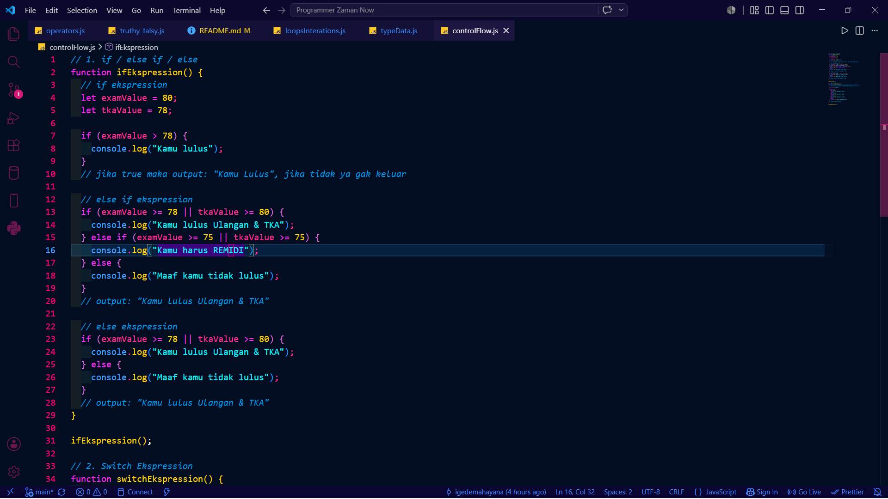

# Materi Belajar JavaScript ES6+

## 1 Variabel & Deklarasi

1. var vs let vs const (why var sekarang dihindari)
2. Hoisting
3. Temporal Dead Zone (TDZ)
4. Variabel Scopes buatkan template readme md dari gambar setiap sub materi

## 2. Tipe Data Primitif & Object

1. String
2. undefined (tidak diisi nilai)
3. number (decimal/bulat)
4. bigint (Angka besar)
5. boolean (true/false)
6. null (kosong)
7. Symbol (Tidak Prioritas)
8. Object (Bukan Type Data Primitif) types:
9. Object literal
10. Array (technically object)
11. Function (technically object juga — first-class citizen)

## 3. Operators in JavaScript

1. Expressions Vs Statements
2. Assignment Operators (=, +=, -=, \*=, /=)
3. Arithmetic Operators (+, -, \*, /, %, \*\*)
4. Comparison Operators (<, >, <=, >=, !=) & equality (== vs === vs Object.is)
5. Logical Operators (&& (AND), || (OR), ! (NOT)
6. Optional Chaining (?) berbeda dengan ternary operator
7. Ternary Operator (? :)
8. Unary Operators (typeof, delete, ++, --)
9. Rest Operators (...) = buat function params & destructuring
10. Spread Operators (...) = buat array/object, BEDA DARI REST!
11. String Operators (Template Literals & Konkatensi)
12. Equality Comparisons (Algoritma pembandingan internal)
    -isLooselyEqual
    -isStrictlyEqual
    -SameValueZero
    -SameValue
13. Nullish Coalescing Operator (??)

## 4. Control Flow

1. if / else if / else [☑]
2. switch statement [☑]
3. Exception Handling: try...catch...finally, throw
4. Error Objects (Error, TypeError, SyntaxError, custom error)
5. Strict Mode ('use strict')

## 5. Loops and Iterations

  

1. for loop (+ break & continue)
2. while loop
3. do...while loop
4. for...of (iterasi ARRAY/iterable — value-based)
5. for...in
   (iterasi OBJECT — key-based, hati-hati jangan dipakai untuk array)
6. Array iteration methods (forEach)
   bukan loop asli tapi sering dipakai sebagai pengganti loop

## Functions
